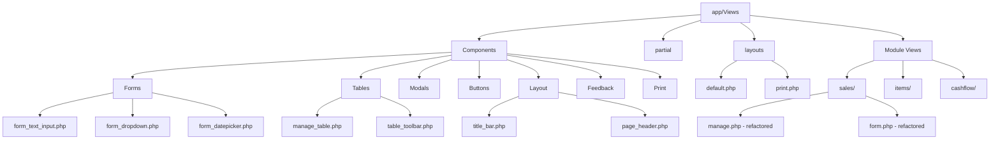

# OSPOS Views Directory Refactoring Plan

**DECISION: Bootstrap 5 Upgrade Selected** ✅

## Executive Summary

This document outlines a comprehensive refactoring strategy for the `@/app/Views` directory in the OSPOS (Open Source Point of Sale) project. The goal is to implement DRY principles, standardize architecture, modernize the UI/UX, and ensure proper translation integration.

---

## 1. Current State Analysis

### 1.1 Directory Structure Overview

```
app/Views/
├── partial/                    # Existing shared components (good foundation)
│   ├── header.php
│   ├── footer.php
│   ├── bootstrap_tables_locale.php
│   ├── datepicker_locale.php
│   ├── daterangepicker.php
│   ├── print_receipt.php
│   └── ... (tax, stock_locations, etc.)
├── configs/                    # Configuration views (13 files)
├── sales/                      # Sales module (17 files)
├── items/                      # Items module (5 files)
├── cashflow/                   # Cashflow module (8 files)
├── customers/                  # Customer views
├── employees/                  # Employee views
├── reports/                    # Reports module (with graphs subdirectory)
├── manufacturing/              # Manufacturing module (nested structure)
├── taxes/                      # Tax configuration views
├── transfers/                  # Transfer module
└── ... (other modules)
```

### 1.2 Identified Repetitive Patterns

#### A. Form Field Patterns (High Priority)

| Pattern | Files Found | Repetition Count |
|---------|-------------|------------------|
| Text input with label | All form.php files | ~50+ occurrences |
| Dropdown/select with label | All form.php files | ~30+ occurrences |
| Input group with icon | items/form.php, people/form_basic_info.php | ~15+ occurrences |
| Required field indicator | All forms | All forms |
| Date/datetime picker | cashflow/form.php, reports/* | ~10+ occurrences |
| Radio button groups | people/form_basic_info.php, items/form.php | ~8+ occurrences |
| Checkbox toggles | configs/*.php | ~20+ occurrences |
| Textarea with label | attributes/form.php | ~5+ occurrences |

**Example of Current Repetition:**
```php
// Repeated in almost every form
<div class="form-group form-group-sm">
    <?= form_label(lang('Common.first_name'), 'first_name', ['class' => 'required control-label col-xs-3']) ?>
    <div class="col-xs-8">
        <?= form_input([
            'name' => 'first_name',
            'id' => 'first_name',
            'class' => 'form-control input-sm',
            'value' => $person_info->first_name
        ]) ?>
    </div>
</div>
```

#### B. Table/Manage View Patterns (High Priority)

| Pattern | Files Found | Description |
|---------|-------------|-------------|
| Title bar with buttons | All manage.php files | Toolbar with CRUD actions |
| Bootstrap table initialization | All manage.php files | Table with pagination, search |
| Date range filter | sales/manage.php, items/manage.php | Daterangepicker integration |
| Filter dropdowns | items/manage.php, sales/manage.php | Multi-select filters |
| Delete button handler | All manage.php files | Bulk delete functionality |

**Current Title Bar Pattern:**
```php
<div id="title_bar" class="btn-toolbar print_hide">
    <button class="btn btn-info btn-sm pull-right modal-dlg" ...>
        <span class="glyphicon glyphicon-import">&nbsp;</span><?= lang('Common.import_csv') ?>
    </button>
    <button class="btn btn-info btn-sm pull-right modal-dlg" ...>
        <span class="glyphicon glyphicon-tag">&nbsp;</span><?= lang(ucfirst($controller_name) . '.new') ?>
    </button>
</div>
```

#### C. Modal/Dialog Patterns (Medium Priority)

| Pattern | Usage | Description |
|---------|-------|-------------|
| Modal dialog wrapper | Throughout app | Bootstrap modal for forms |
| Confirmation dialogs | Delete actions | Confirm before destructive actions |
| Form in modal | CRUD operations | Modal-dlg class pattern |

#### D. Button Patterns (Medium Priority)

| Pattern | Files Found | Description |
|---------|-------------|-------------|
| Primary action button | All views | Green/info buttons with icons |
| Delete button | All manage views | Trash icon + danger styling |
| Toolbar button groups | manage.php files | Button groups in toolbars |
| Icon + text buttons | Throughout | Glyphicon + text pattern |

#### E. Receipt/Print Patterns (Low Priority)

| Pattern | Files Found | Description |
|---------|-------------|-------------|
| Receipt header | sales/receipt*.php | Company info, logo |
| Receipt items table | All receipt views | Line items display |
| Receipt totals | All receipt views | Subtotal, tax, total |
| Receipt footer | All receipt views | Thank you message, barcode |

---

## 2. Proposed Directory Structure

### 2.1 New Components Directory

```
app/Views/
├── Components/                     # NEW: Centralized UI components
│   ├── Forms/                      # Form-related components
│   │   ├── form_text_input.php     # Text input field
│   │   ├── form_dropdown.php       # Select/dropdown field
│   │   ├── form_datepicker.php     # Date picker field
│   │   ├── form_checkbox.php       # Checkbox field
│   │   ├── form_radio_group.php    # Radio button group
│   │   ├── form_textarea.php       # Textarea field
│   │   ├── form_file_upload.php    # File upload field
│   │   ├── form_input_group.php    # Input with icon/addon
│   │   ├── form_section.php        # Form section wrapper
│   │   └── form_actions.php        # Submit/cancel buttons
│   │
│   ├── Tables/                     # Table-related components
│   │   ├── manage_table.php        # Bootstrap table wrapper
│   │   ├── table_toolbar.php       # Toolbar with filters
│   │   ├── table_actions.php       # Row action buttons
│   │   └── table_pagination.php    # Pagination controls
│   │
│   ├── Modals/                     # Modal components
│   │   ├── modal_wrapper.php       # Modal dialog wrapper
│   │   ├── confirm_dialog.php      # Confirmation dialog
│   │   └── form_modal.php          # Modal with form
│   │
│   ├── Buttons/                    # Button components
│   │   ├── action_button.php       # Generic action button
│   │   ├── delete_button.php       # Delete button
│   │   ├── submit_button.php       # Form submit button
│   │   └── button_group.php        # Button group
│   │
│   ├── Layout/                     # Layout components
│   │   ├── page_header.php         # Page title/header
│   │   ├── title_bar.php           # Title bar with actions
│   │   ├── content_wrapper.php     # Main content wrapper
│   │   └── sidebar.php             # Sidebar navigation (future)
│   │
│   ├── Feedback/                   # User feedback components
│   │   ├── alert_success.php       # Success alert
│   │   ├── alert_error.php         # Error alert
│   │   ├── alert_warning.php       # Warning alert
│   │   └── validation_errors.php   # Form validation errors
│   │
│   └── Print/                      # Print/receipt components
│       ├── receipt_header.php      # Receipt header
│       ├── receipt_items.php       # Receipt line items
│       ├── receipt_totals.php      # Receipt totals section
│       └── receipt_footer.php      # Receipt footer
│
├── partial/                        # KEEP: Existing partials (enhance)
│   ├── header.php                  # Keep, enhance
│   ├── footer.php                  # Keep, enhance
│   ├── bootstrap_tables_locale.php # Keep
│   ├── datepicker_locale.php       # Keep
│   └── ... (existing files)
│
├── layouts/                        # NEW: Page layouts
│   ├── default.php                 # Default page layout
│   ├── print.php                   # Print-optimized layout
│   └── minimal.php                 # Minimal layout (for modals)
│
└── [module]/                       # Module-specific views (refactored)
    ├── manage.php                  # Use Components
    ├── form.php                    # Use Components
    └── ...
```

### 2.2 Helper Functions Location

Create new helper file: `app/Helpers/view_helper.php`

```php
// View component rendering functions
function render_form_input(string $name, string $label, array $options = []): string
function render_form_dropdown(string $name, string $label, array $data, array $options = []): string
function render_action_button(string $action, string $label, array $options = []): string
function render_title_bar(array $actions): string
// ... etc
```

---

## 3. Component Specifications

### 3.1 Form Input Component

**File:** `app/Views/Components/Forms/form_text_input.php`

```php
<?php
/**
 * Reusable text input component
 * 
 * @var string $name        Field name
 * @var string $label       Label text (translation key)
 * @var mixed  $value       Field value
 * @var array  $options     Additional options:
 *   - required: bool      Whether field is required
 *   - type: string        Input type (text, email, number, etc.)
 *   - class: string       Additional CSS classes
 *   - placeholder: string Placeholder text
 *   - disabled: bool      Whether field is disabled
 *   - readonly: bool      Whether field is readonly
 *   - icon: string        Glyphicon class for input group
 *   - label_class: string Label width class (default: col-xs-3)
 *   - input_class: string Input wrapper width class (default: col-xs-8)
 *   - help_text: string   Help text below input
 */

$defaults = [
    'required' => false,
    'type' => 'text',
    'class' => '',
    'placeholder' => '',
    'disabled' => false,
    'readonly' => false,
    'icon' => null,
    'label_class' => 'col-xs-3',
    'input_class' => 'col-xs-8',
    'help_text' => null,
];
$options = array_merge($defaults, $options ?? []);

$label_attrs = ['class' => 'control-label ' . $options['label_class']];
if ($options['required']) {
    $label_attrs['class'] .= ' required';
}

$input_attrs = [
    'name' => $name,
    'id' => $name,
    'class' => 'form-control input-sm ' . $options['class'],
    'type' => $options['type'],
    'value' => $value ?? '',
];
if ($options['placeholder']) $input_attrs['placeholder'] = lang($options['placeholder']);
if ($options['disabled']) $input_attrs['disabled'] = 'disabled';
if ($options['readonly']) $input_attrs['readonly'] = 'readonly';
?>

<div class="form-group form-group-sm">
    <?= form_label(lang($label), $name, $label_attrs) ?>
    <div class="<?= $options['input_class'] ?>">
        <?php if ($options['icon']): ?>
            <div class="input-group">
                <span class="input-group-addon input-sm">
                    <span class="glyphicon glyphicon-<?= $options['icon'] ?>"></span>
                </span>
                <?= form_input($input_attrs) ?>
            </div>
        <?php else: ?>
            <?= form_input($input_attrs) ?>
        <?php endif; ?>
        <?php if ($options['help_text']): ?>
            <span class="help-block"><?= lang($options['help_text']) ?></span>
        <?php endif; ?>
    </div>
</div>
```

**Usage Example:**
```php
// Before (repetitive)
<div class="form-group form-group-sm">
    <?= form_label(lang('Common.first_name'), 'first_name', ['class' => 'required control-label col-xs-3']) ?>
    <div class="col-xs-8">
        <?= form_input([
            'name' => 'first_name',
            'id' => 'first_name',
            'class' => 'form-control input-sm',
            'value' => $person_info->first_name
        ]) ?>
    </div>
</div>

// After (DRY)
<?= view('Components/Forms/form_text_input', [
    'name' => 'first_name',
    'label' => 'Common.first_name',
    'value' => $person_info->first_name,
    'options' => ['required' => true]
]) ?>
```

### 3.2 Form Dropdown Component

**File:** `app/Views/Components/Forms/form_dropdown.php`

```php
<?php
/**
 * Reusable dropdown/select component
 * 
 * @var string $name        Field name
 * @var string $label       Label text (translation key)
 * @var array  $options     Select options [value => label]
 * @var mixed  $selected    Selected value
 * @var array  $attrs       Additional attributes:
 *   - required: bool      Whether field is required
 *   - class: string       Additional CSS classes
 *   - label_class: string Label width class
 *   - input_class: string Select wrapper width class
 *   - empty_option: string Add empty option with this text
 *   - multiple: bool      Whether multiple select
 *   - onchange: string    JavaScript onchange handler
 */
```

### 3.3 Title Bar Component

**File:** `app/Views/Components/Layout/title_bar.php`

```php
<?php
/**
 * Reusable title bar with action buttons
 * 
 * @var array $actions      Array of action buttons
 *   Each action: [
 *     'label' => string,      Translation key
 *     'icon' => string,       Glyphicon class
 *     'class' => string,      Button class (default: btn-info)
 *     'href' => string,       Link URL
 *     'modal' => bool,        Whether opens in modal
 *     'data' => array,        Additional data attributes
 *   ]
 * @var string $class       Additional wrapper classes
 */
?>

<div id="title_bar" class="btn-toolbar print_hide <?= $class ?? '' ?>">
    <?php foreach ($actions ?? [] as $action): ?>
        <?php 
        $btn_class = $action['class'] ?? 'btn-info';
        $btn_attrs = ['class' => "btn {$btn_class} btn-sm pull-right"];
        
        if ($action['modal'] ?? false) {
            $btn_attrs['class'] .= ' modal-dlg';
            if (isset($action['data']['btn_submit'])) {
                $btn_attrs['data-btn-submit'] = lang($action['data']['btn_submit']);
            }
            if (isset($action['data']['btn_new'])) {
                $btn_attrs['data-btn-new'] = lang($action['data']['btn_new']);
            }
        }
        if (!empty($action['href'])) {
            $btn_attrs['data-href'] = $action['href'];
        }
        if (!empty($action['title'])) {
            $btn_attrs['title'] = lang($action['title']);
        }
        ?>
        <button <?= stringify_attributes($btn_attrs) ?>>
            <?php if (!empty($action['icon'])): ?>
                <span class="glyphicon glyphicon-<?= $action['icon'] ?>">&nbsp;</span>
            <?php endif; ?>
            <?= lang($action['label']) ?>
        </button>
    <?php endforeach; ?>
</div>
```

**Usage Example:**
```php
// Before
<div id="title_bar" class="btn-toolbar print_hide">
    <button class="btn btn-info btn-sm pull-right modal-dlg" data-btn-submit="<?= lang('Common.submit') ?>" data-href="<?= "$controller_name/csvImport" ?>" title="<?= lang('Items.import_items_csv') ?>">
        <span class="glyphicon glyphicon-import">&nbsp;</span><?= lang('Common.import_csv') ?>
    </button>
    <button class="btn btn-info btn-sm pull-right modal-dlg" data-btn-new="<?= lang('Common.new') ?>" data-btn-submit="<?= lang('Common.submit') ?>" data-href="<?= "$controller_name/view" ?>" title="<?= lang(ucfirst($controller_name) . '.new') ?>">
        <span class="glyphicon glyphicon-tag">&nbsp;</span><?= lang(ucfirst($controller_name) . '.new') ?>
    </button>
</div>

// After
<?= view('Components/Layout/title_bar', [
    'actions' => [
        [
            'label' => 'Common.import_csv',
            'icon' => 'import',
            'class' => 'btn-info',
            'href' => "$controller_name/csvImport",
            'modal' => true,
            'title' => 'Items.import_items_csv',
            'data' => ['btn_submit' => 'Common.submit']
        ],
        [
            'label' => ucfirst($controller_name) . '.new',
            'icon' => 'tag',
            'class' => 'btn-info',
            'href' => "$controller_name/view",
            'modal' => true,
            'title' => ucfirst($controller_name) . '.new',
            'data' => ['btn_new' => 'Common.new', 'btn_submit' => 'Common.submit']
        ],
    ]
]) ?>
```

### 3.4 Table Toolbar Component

**File:** `app/Views/Components/Tables/table_toolbar.php`

```php
<?php
/**
 * Reusable table toolbar with filters and actions
 * 
 * @var array $actions      Action buttons (delete, bulk edit, etc.)
 * @var array $filters      Filter configurations
 * @var array $date_range   Date range picker configuration
 * @var array $custom       Custom filter elements
 */
?>
```

---

## 4. Standardization Guidelines

### 4.1 File Naming Conventions

| Type | Convention | Example |
|------|------------|---------|
| Component files | snake_case | `form_text_input.php` |
| View files | snake_case | `manage.php`, `form.php` |
| Layout files | snake_case | `default.php` |
| Partial files | snake_case | `header.php` |
| Module directories | snake_case | `cashflow/`, `price_offers/` |

### 4.2 PHP Template Syntax Standards

```php
// ✅ GOOD: Consistent PHP tag usage
<?php
/**
 * @var string $controller_name
 * @var array $config
 */
?>

<div class="container">
    <?php if ($condition): ?>
        <p><?= lang('Common.text') ?></p>
    <?php endif; ?>
    
    <?php foreach ($items as $item): ?>
        <tr>
            <td><?= esc($item->name) ?></td>
        </tr>
    <?php endforeach; ?>
</div>

// ❌ BAD: Inconsistent formatting
<?php if($condition){ ?>
    <p><?php echo lang('Common.text'); ?></p>
<?php } ?>
```

### 4.3 Docblock Standards

Every view file MUST start with:
```php
<?php
/**
 * Brief description of the view
 * 
 * @var Type $variable_name    Description
 * @var Type $another_var      Description
 */
?>
```

### 4.4 Translation Key Standards

- Always use `lang()` function for user-visible text
- Use full translation key path: `lang('Module.key_name')`
- Never hardcode English text in views
- Common keys from [`Common.php`](app/Language/ar-EG/Common.php) should be used for shared elements:
  - `Common.submit`, `Common.cancel`, `Common.delete`
  - `Common.edit`, `Common.new`, `Common.search`
  - `Common.required`, `Common.close`

---

## 5. UI/UX Modernization Strategy

### 5.1 Current State Assessment

**Strengths:**
- Bootstrap 3 framework already in use
- Bootswatch themes available for customization
- Responsive base (container, grid system)
- Icon support via Glyphicons

**Weaknesses:**
- Bootstrap 3 is outdated (current is Bootstrap 5.3)
- Limited mobile optimization
- Inconsistent spacing and typography
- No CSS custom properties for theming
- Duplicated CSS in multiple files

### 5.2 Modernization Approach

**SELECTED: Bootstrap 5 Upgrade** ✅

#### Bootstrap 5 Migration Guide

**Key Changes from Bootstrap 3 to Bootstrap 5:**

| Bootstrap 3 | Bootstrap 5 | Notes |
|-------------|-------------|-------|
| `pull-left` | `float-start` | RTL support |
| `pull-right` | `float-end` | RTL support |
| `hidden-xs`, `hidden-sm` | `d-none d-md-block` | New visibility classes |
| `form-group` | `mb-3` | Spacing utilities |
| `input-sm` | `form-control-sm` | New sizing classes |
| `btn-xs` | `btn-sm` | Extra small removed |
| `panel` | `card` | New component name |
| `glyphicon glyphicon-*` | `bi bi-*` | Bootstrap Icons |
| `label` | `badge` | Component renamed |
| `col-xs-*` | `col-*` | Extra small is now default |

**Migration Steps:**

1. **Update Build Configuration**
   - Update `gulpfile.js` to use Bootstrap 5
   - Replace Glyphicons with Bootstrap Icons
   - Use existing `resources/bootswatch5/` directory

2. **CSS Class Updates**
   ```css
   /* Before (Bootstrap 3) */
   .pull-right { float: right !important; }
   .hidden-xs { display: block !important; }
   
   /* After (Bootstrap 5) */
   .float-end { float: right !important; } /* or left for RTL */
   .d-none .d-md-block { /* responsive visibility */ }
   ```

3. **JavaScript Updates**
   - Remove jQuery dependency where possible
   - Use vanilla JS for new components
   - Update modal/tooltip initialization

4. **Icon Migration**
   ```html
   <!-- Before -->
   <span class="glyphicon glyphicon-trash"></span>
   
   <!-- After -->
   <i class="bi bi-trash"></i>
   <!-- or -->
   <svg class="bi"><use xlink:href="#trash"/></svg>
   ```

5. **Form Updates**
   ```html
   <!-- Before -->
   <div class="form-group">
     <label class="control-label col-xs-3">Label</label>
     <div class="col-xs-9">
       <input type="text" class="form-control input-sm">
     </div>
   </div>
   
   <!-- After -->
   <div class="row mb-3">
     <label class="col-sm-3 col-form-label col-form-label-sm">Label</label>
     <div class="col-sm-9">
       <input type="text" class="form-control form-control-sm">
     </div>
   </div>
   ```

**Benefits of Bootstrap 5:**
- Modern grid system with CSS Grid support
- CSS custom properties for easy theming
- Improved accessibility (WCAG 2.1)
- Smaller bundle size
- RTL support
- No jQuery dependency (optional)
- Better responsive utilities

### 5.3 Recommended CSS Architecture

```css
/* public/css/components.css - New component styles */

/* CSS Custom Properties for theming */
:root {
    --color-primary: #2C3E50;
    --color-secondary: #18BC9C;
    --color-danger: #E74C3C;
    --color-warning: #F39C12;
    --color-success: #27AE60;
    
    --spacing-xs: 0.25rem;
    --spacing-sm: 0.5rem;
    --spacing-md: 1rem;
    --spacing-lg: 1.5rem;
    --spacing-xl: 2rem;
    
    --border-radius: 4px;
    --shadow-sm: 0 1px 2px rgba(0,0,0,0.05);
    --shadow-md: 0 4px 6px rgba(0,0,0,0.1);
    
    --font-size-sm: 0.85rem;
    --font-size-base: 1rem;
    --font-size-lg: 1.25rem;
}

/* Form Components */
.form-group-modern {
    margin-bottom: var(--spacing-md);
}

.form-label-modern {
    display: block;
    margin-bottom: var(--spacing-xs);
    font-weight: 500;
    color: var(--color-primary);
}

.form-control-modern {
    width: 100%;
    padding: var(--spacing-sm) var(--spacing-md);
    border: 1px solid #ddd;
    border-radius: var(--border-radius);
    transition: border-color 0.2s, box-shadow 0.2s;
}

.form-control-modern:focus {
    outline: none;
    border-color: var(--color-secondary);
    box-shadow: 0 0 0 3px rgba(24, 188, 156, 0.2);
}

/* Button Components */
.btn-modern {
    display: inline-flex;
    align-items: center;
    gap: var(--spacing-xs);
    padding: var(--spacing-sm) var(--spacing-md);
    border-radius: var(--border-radius);
    font-weight: 500;
    transition: all 0.2s;
}

.btn-modern:hover {
    transform: translateY(-1px);
    box-shadow: var(--shadow-md);
}

/* Card Components */
.card-modern {
    background: white;
    border-radius: var(--border-radius);
    box-shadow: var(--shadow-sm);
    padding: var(--spacing-lg);
}

/* Responsive Utilities */
@media (max-width: 768px) {
    .form-group-modern {
        flex-direction: column;
    }
    
    .btn-toolbar-modern {
        flex-wrap: wrap;
        gap: var(--spacing-sm);
    }
}
```

### 5.4 Mobile Responsiveness Improvements

```css
/* Enhanced mobile styles */
@media (max-width: 576px) {
    /* Stack form groups vertically */
    .form-group-sm {
        flex-direction: column;
    }
    
    .form-group-sm .control-label {
        text-align: left;
        margin-bottom: 0.5rem;
    }
    
    /* Full-width buttons on mobile */
    .btn-toolbar .btn {
        width: 100%;
        margin-bottom: 0.5rem;
    }
    
    /* Collapsible navigation */
    .navbar-collapse {
        max-height: 80vh;
        overflow-y: auto;
    }
    
    /* Touch-friendly targets */
    .btn, .nav > li > a {
        min-height: 44px;
        padding: 10px 15px;
    }
}
```

---

## 6. Translation Integration

### 6.1 Current Translation System

The project uses CodeIgniter's language system with files in `app/Language/{locale}/`.

**Key files:**
- [`Common.php`](app/Language/ar-EG/Common.php) - Shared translations
- Module-specific files (e.g., `Items.php`, `Sales.php`)

### 6.2 Component Translation Strategy

All components MUST use translation keys, never hardcoded text:

```php
// ✅ GOOD
<?= lang('Common.submit') ?>
<?= lang('Items.name') ?>

// ❌ BAD
Submit
Item Name
```

### 6.3 Missing Translation Keys

Add to `Common.php`:
```php
"loading" => "Loading...",
"saving" => "Saving...",
"confirm_delete" => "Are you sure you want to delete this item?",
"confirm_action" => "Are you sure you want to proceed?",
"action_cannot_undo" => "This action cannot be undone.",
"select_all" => "Select All",
"deselect_all" => "Deselect All",
"showing_x_to_y_of_z" => "Showing {0} to {1} of {2} entries",
"no_results_found" => "No results found",
"clear_filters" => "Clear Filters",
"apply_filters" => "Apply Filters",
```

---

## 7. Implementation Phases

### Phase 1: Foundation (Priority: High)

1. Create `Components/` directory structure
2. Implement core form components:
   - `form_text_input.php`
   - `form_dropdown.php`
   - `form_checkbox.php`
   - `form_radio_group.php`
3. Create `view_helper.php` with helper functions
4. Add CSS custom properties to `ospos.css`

### Phase 2: Layout Components (Priority: High)

1. Implement layout components:
   - `title_bar.php`
   - `page_header.php`
2. Implement button components:
   - `action_button.php`
   - `delete_button.php`
3. Implement feedback components:
   - `alert_*.php`
   - `validation_errors.php`

### Phase 3: Table Components (Priority: Medium)

1. Implement table components:
   - `manage_table.php`
   - `table_toolbar.php`
   - `table_actions.php`
2. Refactor manage views to use components

### Phase 4: Modal Components (Priority: Medium)

1. Implement modal components:
   - `modal_wrapper.php`
   - `confirm_dialog.php`
2. Standardize modal dialog usage

### Phase 5: Module Refactoring (Priority: Medium-High)

Refactor modules in order of complexity:

1. **Simple modules first:**
   - `attributes/` - 3 files
   - `giftcards/` - 2 files
   - `suppliers/` - 1 file

2. **Medium complexity:**
   - `customers/` - 2 files
   - `employees/` - 1 file
   - `taxes/` - 5 files

3. **Complex modules:**
   - `items/` - 5 files (high usage)
   - `sales/` - 17 files (critical path)
   - `configs/` - 15 files

### Phase 6: Print/Receipt Components (Priority: Low)

1. Implement receipt components
2. Refactor receipt views
3. Standardize print layouts

### Phase 7: Documentation & Testing (Priority: Ongoing)

1. Document all components
2. Create usage examples
3. Test across all modules
4. Update developer guide

---

## 8. File Hierarchy Diagram



---

## 9. Risk Assessment

| Risk | Impact | Mitigation |
|------|--------|------------|
| Breaking existing functionality | High | Comprehensive testing, gradual rollout |
| Translation key conflicts | Medium | Use namespaced keys, audit existing |
| Performance overhead | Low | Benchmark components, cache views |
| Developer adoption | Medium | Clear documentation, code examples |
| Design inconsistency during transition | Medium | Style guide, component preview page |

---

## 10. Success Metrics

1. **Code Reduction:** Target 30% reduction in view file lines
2. **DRY Compliance:** No repeated form field patterns
3. **Translation Coverage:** 100% of user-visible text uses `lang()`
4. **Mobile Score:** Lighthouse mobile score > 80
5. **Maintainability:** New features use components within 1 sprint

---

## 11. Next Steps

1. Review and approve this plan
2. Create `Components/` directory structure
3. Implement Phase 1 components
4. Create component preview/test page
5. Begin module refactoring

---

*Document Version: 1.0*
*Created: 2026-03-30*
*Author: Lead Frontend Architect*
